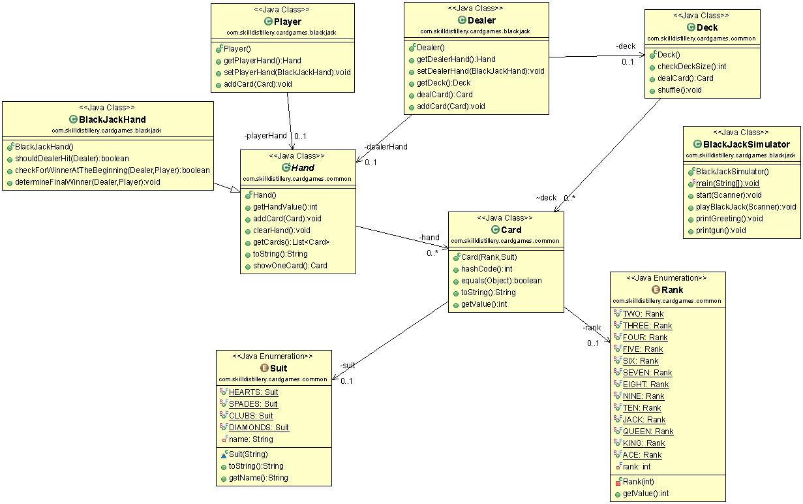

### Blackjack Project
This application is a working BlackJack card game.There are 2 players: dealer and player(user). The deck of 52 cards are given to dealer and player. 
The aim of the game is to obtain a higher total card count than the Dealer, without going over 21.

## Theme
User is a British agent 007, James Bond, who goes to Casino Royale and need to win BlackJack tournament to save the world.

### Project Description

## Objectives

There are 2 package: 
* common : Classes that can be reused in other card games

* blackjack - Classes that can be used specifically in blackJack game

## Topics/Technologies
* Java
* Git command line
* Eclipse IDE
* Object Oriented Design 
  * Polymorphism
  * Inheritance  
* Java Collections Framework
* Enumerated Types
* UML class design

